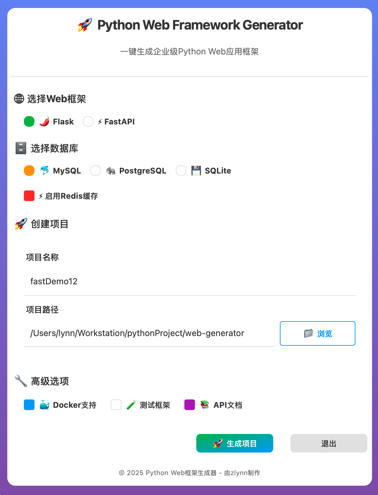
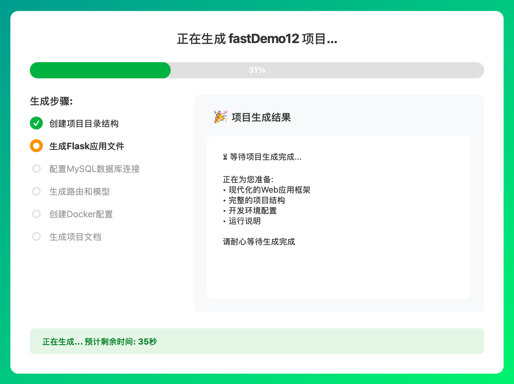

# 🚀 Python Web Framework Generator

<div align="center">
  
  
  
  
</div>

<p align="center">
  <strong>一个强大的企业级Python Web应用框架生成工具</strong><br>
  通过直观的GUI界面，快速创建基于不同Web框架和数据库的项目骨架
</p>

## ✨ 功能特点

### 🌐 支持的Web框架
- **Flask** - 轻量级、灵活的微框架
- **FastAPI** - 现代、高性能的异步API框架

### 🗄️ 支持的数据库
- **MySQL** - 流行的关系型数据库
- **PostgreSQL** - 功能强大的开源数据库
- **SQLite** - 轻量级嵌入式数据库

### 🔧 核心功能
- ⚡ **Redis缓存集成** - 可选的高性能缓存层
- 📚 **自动生成项目文档** - 完整的API文档和使用说明
- 🧪 **内置测试框架** - pytest配置和示例测试
- 🐳 **Docker支持** - 完整的容器化配置
- 📖 **API文档生成** - Swagger/OpenAPI自动文档
- 🔐 **用户认证系统** - JWT令牌认证
- 📝 **日志配置** - 结构化日志记录
- ⚙️ **环境变量配置** - 灵活的配置管理
- 🖥️ **现代GUI界面** - PyQt5图形用户界面

## 📦 安装

### 前置要求
- Python 3.8 或更高版本
- pip 包管理器

### 系统依赖（可选）

**macOS:**
```bash
# 如需使用mysqlclient（高性能MySQL驱动）
brew install mysql pkg-config
```

**Ubuntu/Debian:**
```bash
# 如需使用mysqlclient
sudo apt-get install libmysqlclient-dev pkg-config
```

**Windows:**
- 推荐使用PyMySQL（已包含在requirements.txt中）

### 快速安装

```bash
# 克隆仓库
git clone https://github.com/zketer/WebGenerator.git
cd WebGenerator

# 安装依赖
pip install -r requirements.txt
```

## 🚀 使用方法

### 启动GUI界面

```bash
python main.py
```

### 使用步骤

1. **选择Web框架** - Flask 或 FastAPI
2. **选择数据库** - MySQL、PostgreSQL 或 SQLite
3. **配置项目** - 输入项目名称和路径
4. **可选功能** - 选择是否启用Redis缓存
5. **生成项目** - 点击生成按钮创建项目

> 💡 **提示**: 生成的项目包含完整的开发环境配置，可以立即开始开发！

## 📸 界面预览

### 主界面

*现代化的PyQt5界面，支持所有主流框架和数据库选择*

### 项目生成

*一键生成完整的企业级项目结构*

## 📁 生成的项目结构

### Flask项目结构
```
my_flask_project/
├── app/
│   ├── __init__.py
│   ├── api/
│   │   ├── __init__.py
│   │   └── routes.py
│   ├── models/
│   │   ├── __init__.py
│   │   └── base.py
│   └── config/
│       ├── __init__.py
│       └── settings.py
├── tests/
│   ├── __init__.py
│   ├── conftest.py
│   └── test_api.py
├── docs/
│   ├── index.md
│   └── api.md
├── Dockerfile
├── requirements.txt
├── .env
└── README.md
```

### FastAPI项目结构
```
my_fastapi_project/
├── app/
│   ├── __init__.py
│   ├── main.py
│   ├── api/
│   │   ├── __init__.py
│   │   ├── deps.py
│   │   └── v1/
│   │       ├── __init__.py
│   │       └── endpoints.py
│   ├── core/
│   │   ├── __init__.py
│   │   └── config.py
│   ├── db/
│   │   ├── __init__.py
│   │   └── session.py
│   ├── models/
│   │   ├── __init__.py
│   │   └── item.py
│   └── schemas/
│       ├── __init__.py
│       └── item.py
├── tests/
│   ├── __init__.py
│   ├── conftest.py
│   └── test_api.py
├── docs/
│   ├── index.md
│   └── api.md
├── Dockerfile
├── requirements.txt
├── .env
└── README.md
```

### 🎯 项目特性

- ✅ **完整的项目结构** - 遵循最佳实践的目录组织
- ✅ **数据库连接配置** - 支持多种数据库的即插即用配置
- ✅ **用户认证系统** - JWT令牌认证和权限管理
- ✅ **API文档** - 自动生成的Swagger/OpenAPI文档
- ✅ **测试框架** - pytest配置和示例测试用例
- ✅ **Docker配置** - 生产就绪的容器化配置
- ✅ **环境变量设置** - 安全的配置管理
- ✅ **日志配置** - 结构化日志记录
- ✅ **详细的README文档** - 完整的使用说明和API文档

## 🤝 贡献

我们欢迎所有形式的贡献！无论是报告bug、提出新功能建议，还是提交代码改进。

### 如何贡献

1. **Fork** 这个仓库
2. **创建** 你的功能分支 (`git checkout -b feature/AmazingFeature`)
3. **提交** 你的更改 (`git commit -m 'Add some AmazingFeature'`)
4. **推送** 到分支 (`git push origin feature/AmazingFeature`)
5. **打开** 一个 Pull Request

### 开发环境设置

```bash
# 克隆你的fork
git clone https://github.com/zketer/WebGenerator.git
cd WebGenerator
```

## 🧪 开发

### 开发环境设置

```bash
# 创建虚拟环境
python -m venv venv
source venv/bin/activate  # Linux/Mac
# 或
venv\Scripts\activate  # Windows

# 安装开发依赖
pip install -r requirements.txt

# 运行测试
python -m pytest
```

## 📁 项目结构

```
WebGenerator/
├── assets/                   # 资源文件
│   ├── icon.svg             # 项目图标(SVG)
│   └── icon.png             # 项目图标(PNG)
├── docs/                    # 项目文档
│   ├── README.md           # 文档导航
│   ├── BUILD_README.md     # 构建说明
│   ├── PACKAGING.md        # 打包文档
│   └── DISTRIBUTION_GUIDE.md # 分发指南
├── generators/              # 代码生成器
│   ├── base_generator.py   # 基础生成器
│   ├── flask_generator.py  # Flask生成器
│   └── fastapi_generator.py # FastAPI生成器
├── scripts/                 # 构建脚本
│   ├── README.md           # 脚本说明
│   ├── build_package.py    # 跨平台构建
│   ├── build_macos.sh      # macOS构建
│   ├── build_windows.bat   # Windows构建
│   ├── setup.py            # cx_Freeze配置
│   └── Makefile            # Make配置
├── screenshots/             # 界面截图
├── templates/               # 项目模板
│   ├── flask/              # Flask模板
│   └── fastapi/            # FastAPI模板
├── test/                    # 测试文件
├── utils/                   # 工具模块
│   ├── config_manager.py   # 配置管理
│   └── logger.py           # 日志工具
├── main.py                  # 主程序入口
├── requirements.txt         # 运行依赖
├── requirements-build.txt   # 构建依赖
└── .gitignore              # Git忽略文件
```

## 📦 构建和打包

本项目支持构建为独立的桌面应用程序，无需安装Python环境即可运行。

### 🚀 快速构建

**macOS/Linux:**
```bash
# 使用自动化脚本
./scripts/build_macos.sh
```

**Windows:**
```cmd
# 使用批处理脚本
scripts\build_windows.bat

# 或使用Python脚本
python scripts/build_windows_simple.py
```

### 📁 构建脚本

所有构建相关的脚本都位于 `scripts/` 目录中：

- `build_macos.sh` - macOS自动化构建脚本
- `build_windows.bat` - Windows批处理构建脚本  
- `build_windows_simple.py` - Windows Python构建脚本
- `build_package.py` - 跨平台高级构建脚本
- `setup.py` - cx_Freeze配置文件
- `Makefile` - Make构建配置

### 📋 输出文件

构建完成后，可执行文件和安装包将生成在 `dist/` 目录中：

- **macOS**: `Web Generator.app` 和 `Web Generator.dmg`
- **Windows**: `Web Generator.exe` 和可选的MSI安装包

### 📚 详细文档

- [scripts/README.md](scripts/README.md) - 构建脚本详细说明
- [docs/DISTRIBUTION_GUIDE.md](docs/DISTRIBUTION_GUIDE.md) - 分发指南
- [docs/BUILD_README.md](docs/BUILD_README.md) - 详细构建说明
- [docs/PACKAGING.md](docs/PACKAGING.md) - 打包技术文档

## 📄 许可证

本项目采用 MIT 许可证 - 查看 [LICENSE](LICENSE) 文件了解详情。

## 🙏 致谢

- [Flask](https://flask.palletsprojects.com/) - 优秀的Python微框架
- [FastAPI](https://fastapi.tiangolo.com/) - 现代、快速的Web框架
- [PyQt5](https://www.riverbankcomputing.com/software/pyqt/) - 强大的GUI框架
- [SQLAlchemy](https://www.sqlalchemy.org/) - Python SQL工具包

## 👨‍💻 作者

**zlynn** - *项目创建者和主要维护者*

## 📞 联系方式

如果你有任何问题或建议，请通过以下方式联系我们：

- 🐛 Issues: [GitHub Issues](https://github.com/zketer/WebGenerator/issues)
- 💬 Discussions: [GitHub Discussions](https://github.com/zketer/WebGenerator/discussions)
- 📂 项目主页: [GitHub Repository](https://github.com/zketer/WebGenerator)

---

<div align="center">
  <strong>⭐ 如果这个项目对你有帮助，请给我们一个星标！ ⭐</strong>
</div>